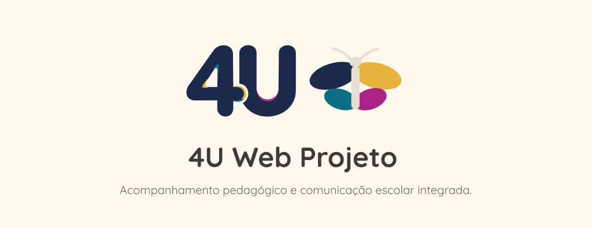

# FECAP - Fundação de Comércio Álvares Penteado

<p align="center">
<a href= "https://www.fecap.br/"></a>
</p>

# Sistema Web Responsivo para Comunicação entre Escola, Professores e Responsáveis
## 4U

## Integrantes: <a href="https://www.linkedin.com/in/anna-paula-alves/">Anna Paula Alves Silva</a>, <a href="https://www.linkedin.com/in/dilly-martins-217176361/">Dilly Martins da Silva</a>, <a href="https://www.linkedin.com/in/laurarayssa/">Laura Rayssa Souza Araújo</a>, <a href="https://www.linkedin.com/in/rafaela-carvalho-barcos-mello-8484ba282/">Rafaela Carvalho Barcos Mello</a>

## Professores Orientadores: <a href="https://www.linkedin.com/in/adriano-valente/">Adriano Felix Valente</a>, <a href="https://www.linkedin.com/in/eduardo-savino/">Eduardo Savino Gomes</a>, <a href="https://www.linkedin.com/in/francisco-escobar/">Francisco Escobar</a>, <a href="https://www.linkedin.com/in/jbuesso/">José Carlos Buesso Junior</a>, <a href="https://www.linkedin.com/in/ronaldo-araujo-pinto-3542811a/">Ronaldo Araujo Pinto</a>,

## Descrição

<p align="center">
  
</p>

O projeto 4U consiste em uma aplicação web responsiva desenvolvida para escolas de Ensino Fundamental, com o objetivo de otimizar o acompanhamento acadêmico bimestral e integrar a comunicação entre professores, gestão escolar e famílias. Por meio da plataforma, os docentes registram o desempenho de cada estudante em suas disciplinas, inserindo a média do bimestre, tags de acompanhamento e uma descrição qualitativa detalhada.Antes de chegarem aos familiares, esses registros passam por uma etapa de moderação da administração escolar, que pode revisar, ajustar, devolver para correções ou publicar as informações. Uma vez aprovados, os pais ou responsáveis conseguem visualizar de forma exclusiva os relatórios publicados dos alunos vinculados ao seu perfil, contando ainda com a facilidade de gerar e baixar o documento em Excel.
<br><br>
O projeto 4U conecta professores, administração e responsáveis através de uma plataforma web responsiva, otimizando o fluxo de informações e o monitoramento pedagógico dentro da comunidade escolar
<br><br>

## 🛠 Estrutura de pastas

-Raiz<br>
|<br>
|-->documentos<br>
|  &emsp;|-->Entrega 1<br>
|  &emsp; &emsp;|-->Banco de Dados<br>
|  &emsp; &emsp;|-->Desenvolvimento Web Fullstack<br>
|  &emsp; &emsp;|-->Design de Interface Digital<br>
|  &emsp; &emsp;|-->Estrutura de Dados<br>
|  &emsp; &emsp;|-->Programação Orientada a Objeto<br>
|  &emsp;|-->Entrega 2<br>
|  &emsp; &emsp;|-->Banco de Dados<br>
|  &emsp; &emsp;|-->Desenvolvimento Web Fullstack<br>
|  &emsp; &emsp;|-->Design de Interface Digital<br>
|  &emsp; &emsp;|-->Estrutura de Dados<br>
|  &emsp; &emsp;|-->Programação Orientada a Objeto<br>
|  &emsp;|-->Documento - Projeto de Extensão - COM Empresa - 2026_1.docx<br>
|  &emsp;|-->MODELO_BANNER_FECAP_2026_1.pptx<br>
|  &emsp;|-->README.md<br>
|<br>
|-->imagens<br>
|  &emsp;|-->imagem_github.jpg<br>
|<br>
|-->src<br>
|  &emsp;|-->Entrega 1<br>
|  &emsp; &emsp;|-->Backend<br>
|  &emsp; &emsp;&emsp;|-->src<br>
|  &emsp; &emsp;|-->Frontend<br>
|  &emsp; &emsp;&emsp;|-->public<br>
|  &emsp; &emsp;&emsp;|-->src<br>
|  &emsp; &emsp;&emsp;&emsp;|-->assets<br>
|  &emsp; &emsp;&emsp;&emsp;|-->components<br>
|  &emsp; &emsp;&emsp;&emsp;|-->pages<br>
|  &emsp;|-->Entrega 2<br>
|  &emsp; &emsp;|-->Backend<br>
|  &emsp; &emsp;|-->Frontend<br>
|<br>
|.gitignore<br>
|readme.md<br>

## 🛠 Tecnologias e Linguagens

<p align="left">
  
  
  
  
  
  
  
  
   
          
## 💻 Configuração para Desenvolvimento

Para abrir este projeto você necessita das seguintes ferramentas:

-<a href="https://code.visualstudio.com/">Visual Studio Code</a>
Encontre na pasta de downloads e execute-o como qualquer outro programa.

-<a href="https://nodejs.org">Node js</a>

No terminal, do Visual Studio Code, a partir da raiz do repositório:

```sh
cd "src/Entrega 1/Frontend"
npm install
npm run dev
```
Depois, abra http://localhost:5173.

## 📋 Licença/License
<a href="https://github.com/2026-2-NADS2/Projeto1">4U</a> © 2026 by <a href="https://example.com"> Anna Paula Alves Silva, Dilly Martins da Silva, Laura Rayssa Souza Araújo e Rafaela Carvalho Barcos Mello</a> is licensed under <a href="https://creativecommons.org/licenses/by/4.0/">Creative Commons Attribution 4.0 International (CC BY 4.0)</a>

## 🎓 Referências

Aqui estão as referências usadas no projeto.

1. <https://github.com/iuricode/readme-template>
2. <https://github.com/gabrieldejesus/readme-model>
3. <https://chooser-beta.creativecommons.org/>
4. <https://freesound.org/>
5. <https://www.toptal.com/developers/gitignore>
6. Músicas por: <a href="https://freesound.org/people/DaveJf/sounds/616544/"> DaveJf </a> e <a href="https://freesound.org/people/DRFX/sounds/338986/"> DRFX </a> ambas com Licença CC 0.
